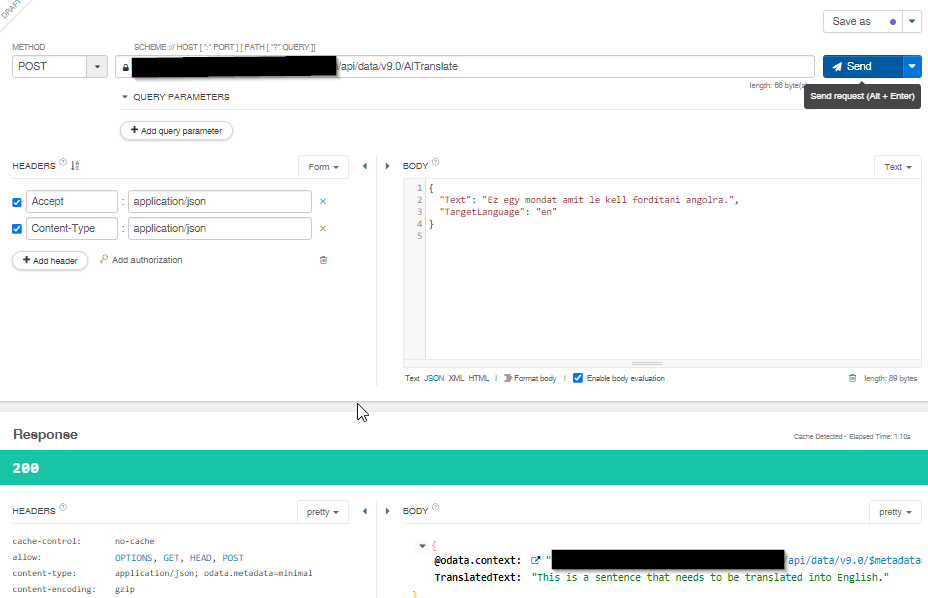

# Make HTTP Call using this script
- Install VS Code: https://code.visualstudio.com/docs/setup/windows
- Install REST Client Extension: https://marketplace.visualstudio.com/items?itemName=humao.rest-client
- Create an App Registratin in Azure: 
  - Can be done without a Subscription
  - If you dont have permission, see other options
  - Setting up App Reg + Application user: https://kb.easysend.io/docs/application-user-setup
    - Azure Active Directory is now called Azure Entra ID
    - You can skip Step1: 12-13
- Open .env file and use ClientId, ClientSecret and TenantId from previous step
- envUrl: https://{my-env}.crm4.dynamics.com

# Other options
- Talend API Tester chrome extension picks up auth context automatically
- No token aquire is neccesery, just the HTTP call
- https://chromewebstore.google.com/detail/talend-api-tester-free-ed/aejoelaoggembcahagimdiliamlcdmfm

  