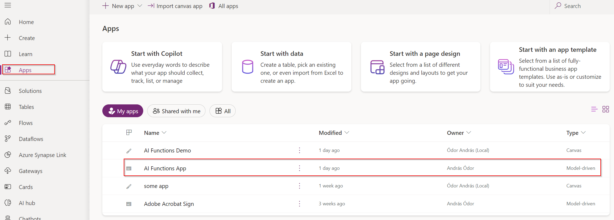

# Whats in here

- **HTTPCall:** raw http call to the translate endpoint
- **Plugin:** plugin source, which creates translate result on record create
- **Solution:** Managed and unmanaged demo solution to import into your own demo env
- **Webresources:** javascript webresource files 

# How to add test records to the app

1. Go to the [make portal](https://make.powerapps.com/)
2. Import the solution package from the Solutions folder
    - Choose the **NoSalesDependency version**, if you dont have the the Lead and Opportunity entities available in you environment. 
3. Go to the App on the nav bar and search for **AI Function App (model-driven)** in the app list
 
4. Play the Model-Driven App
    - You will land on the AI Function Content table
5. Create new records here. 
6. The created records will show up in the canvas app on the left side gallery and you can select them as input for the various actions.

You can create additional categories and sub categories under the proper entities.

In a language subcategory record the language code should go into the Metadata field. 

----------------------------

**Optionally** you can import the examples i showed to you from the excel files in the **SampleRecords folder** for each entity. 
- Follow the import order indicated by the files name on the appropriate entity.
